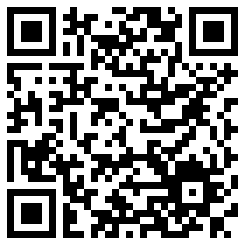

# Gliederung
- Zero-Knowledge Verschlüsselung
- Passwortregeln
- Passwortmanager
- Mehr Faktor Authentisierung
- Abschließende Worte

---

##  Zero-Knowledge Verschlüsselung
- Daten nur für Besitzer zugänglich
    - Nutzdaten + Metadaten
- Dienst kennt das passwort nicht

---

##  Passwortregeln
- Einmalnutzung
- Lang -> mind. 12 Zeichen / 9 Wörter
- Automatisch -> Generieren und Speichern
- Absicherung durch MFA

---

## Passwortmanager
- Verschlüsselter Speicher für Kennworte
- Plattformübergreifend
- Mehr Sicherheit -> nur ein pw merken
- QoL: Autofillin, Autoregister, pw-gen, ...
- Kleiner Nachteil: masterpw

---

### Passwortmanager - cloud

- Syncronisation
- "Überall" erreichbar
- Einfacher zu handeln

---

### Passwortmanager - non-cloud

- Manuelle Syncronisation
- Nur lokal
- Komplizierter ab 2 Geräten

---

### Passwortmanager - Bitwarden

- Open source
    - Selfhost möglich
    - ebenfalls Zero Knowledge E2E-Verschlüsselung
- Auch ohne Abo sehr umfangreich
- Auch offline Nutzbar (Sync nicht möglich) 

---

## Mehr Faktor Authentisierung (MFA)
- Fragt Besitz und Biometrie ab
- Phishing wird schwerer
    - -50% Google-Account übernahmen
- Pw Verlust verkraftbar

---

### MFA - Fallstricke

- Schützt nur bei Anmeldung
- Dauerhafter Zugriffsverlust möglich
    - Wichtig! -> Backupcodes sichern

---

### MFA - Email

- Übertragung im Klartext -> schlecht
- Kom. über 3te (Email Provider) 
- Zentrierung des Risikos
    - Worstcase: Konto-email = 2FA-email

---

### MFA - SMS

- Verbeitet da es einfach ist
- Übertragung im Klartext -> schlecht
- Kom. über 3te (SMS Dienstleister + Provider)

---

### MFA - apps

- Keine Dritten Involviert
    - Email Provider
    - SMS Dienstleister
- Schlüssel (QR-Code) verschlüsselt
- Funktion: 
    - Schlüssel + Zeit = Code
    - srv-Code = clnt-Code -> ok
---

#### MFA - Passwortmanager
- Einfach zu nutzen
- keine Extra Software nötig

Problem: Kreiert einen Single-point-of-failure

---

#### MFA - Google Authenticator

- Simple -> Intuitiv nutzbar
- Kein Backup oder Export möglich

---

#### MFA - Aegis Authenticator

- Simple -> ähnlich zu gAuthenticator
- Bietet Backupmöglichkeiten 
    - Verschlüsselt + Cloud
    
---

---

# Quellen
[Ein Vergleich von PASSWORTMANAGERN](https://www.youtube.com/watch?v=YwbE2iLmAT0)
[Vergleich: NICHT ALLE Zwei-Faktor-Methoden sind sicher!](https://www.youtube.com/watch?v=EY9hiHD9XKU)
[What is zero-knowledge-encryption](https://tresorit.com/blog/zero-knowledge-encryption/)

---

# Bild Quellen
[bitwarden-icon.svg](https://www.vectorlogo.zone/logos/bitwarden/index.html)
[gmail-icon.svg](https://www.vectorlogo.zone/logos/gmail/index.html)
[microsoft_azure-icon.svg](https://www.vectorlogo.zone/logos/microsoft_azure/index.html)
[qrcode.svg](https://goqr.me/)
[sms-chat-bubble.svg](https://freesvg.org/1531719185)
[web-app-developing.svg](https://freesvg.org/web-app-developing)

---

# Extras
Präsentation in Markdown mittels Marpit
[Markdown Presentation Ecosystem](https://marp.app/)
[Never use PowerPoint again](https://www.youtube.com/watch?v=EzQ-p41wNEE#)

---

<!-- footer: Besuche https://github.com/maximizzar/presentation-communication oder via QR code -->

# Präsentation online

